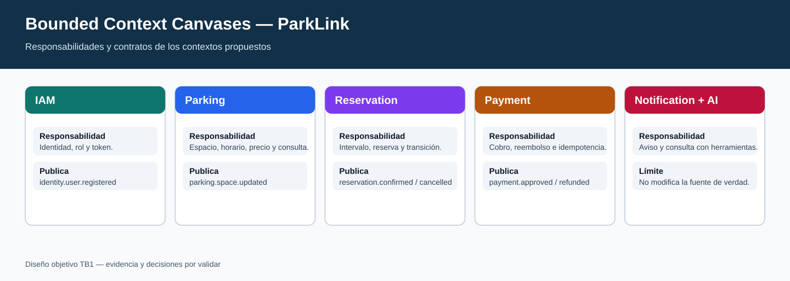
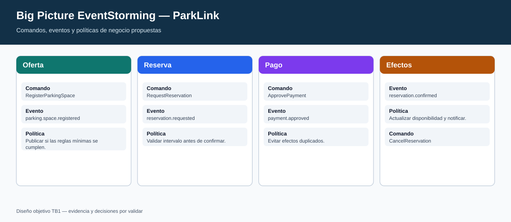
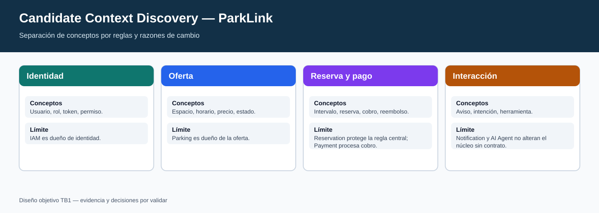
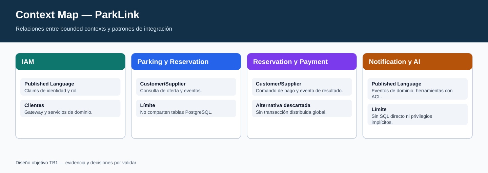
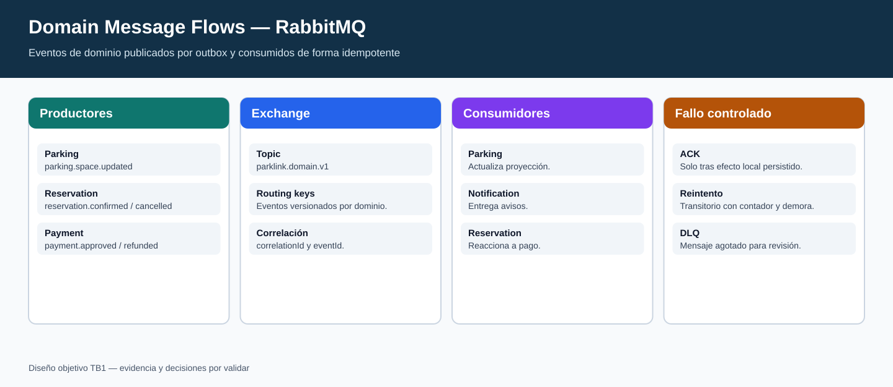
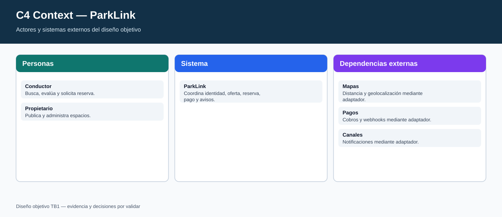
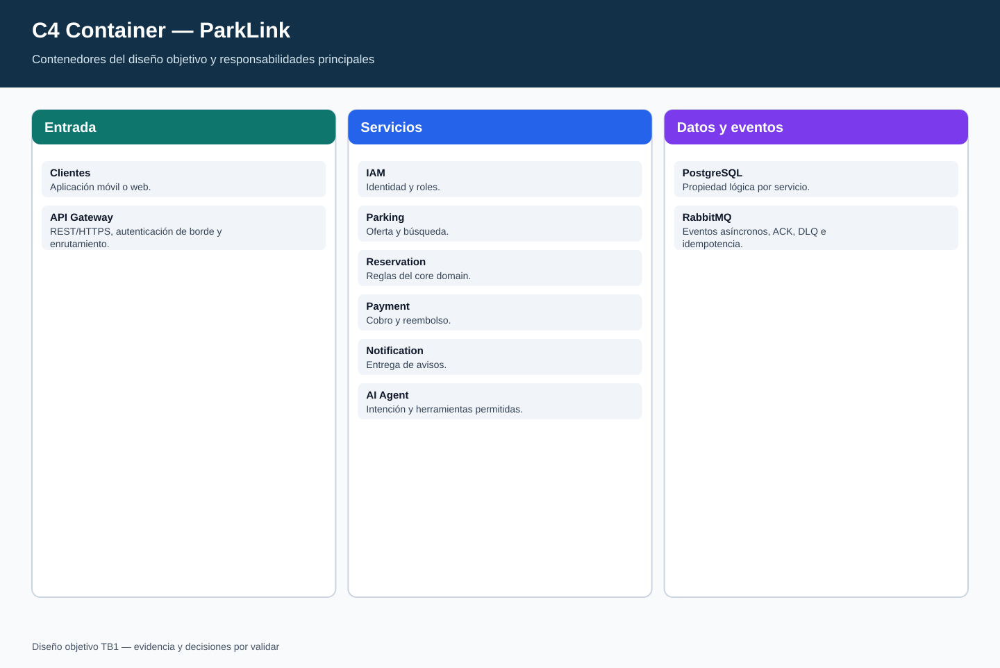
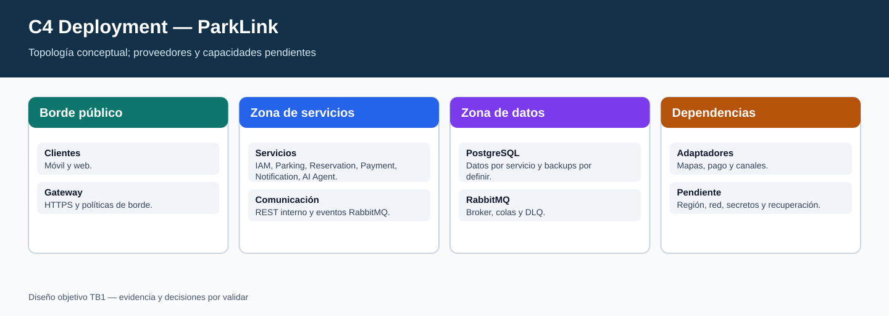
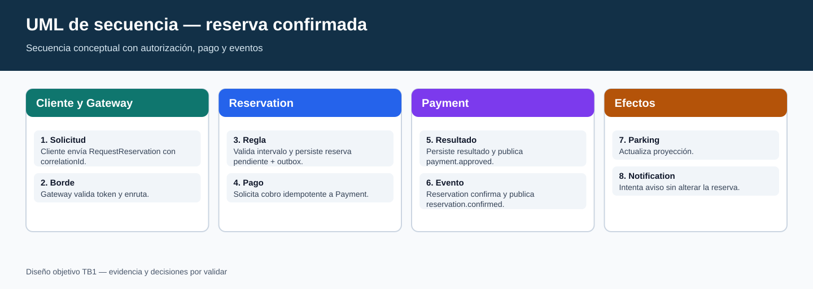

# ParkLink — Informe de Proyecto TB1

> **Estado del documento:** Trabajo de Base 1 (TB1). Este informe presenta evidencia de descubrimiento, especificación y diseño arquitectónico. Los elementos señalados como pendientes no constituyen resultados validados.

## Navegación rápida

- [Información del informe](#información-del-informe)
- [Capítulo I — Perfil y problema](#capítulo-i--perfil-y-problema)
- [Capítulo II — Investigación y análisis](#capítulo-ii--investigación-y-análisis)
- [Capítulo III — Especificación](#capítulo-iii--especificación)
- [Capítulo IV — Diseño de arquitectura](#capítulo-iv--diseño-de-arquitectura)
- [Conclusiones](#conclusiones)
- [Bibliografía](#bibliografía)
- [Anexos](#anexos)

## Información del informe

| Campo | Información |
|---|---|
| Universidad | Universidad Peruana de Ciencias Aplicadas |
| Carrera | Ingeniería de Software |
| Curso | 1ACC0238 — Aplicaciones para Dispositivos Móviles |
| Entrega | TB1 |
| Startup | ParkLink |
| Producto | ParkLink |
| Periodo, NRC y docente | TODO — confirmar datos vigentes antes de la exportación |
| Mes y año | TODO — confirmar antes de la exportación |

### Relación de integrantes

| Código | Apellidos y nombres |
|---|---|
| U202310971 | Pietro Osores Marchese |
| — | TODO – Integrante pendiente |
| — | TODO – Integrante pendiente |
| — | TODO – Integrante pendiente |

### Registro de versiones

| Versión | Fecha | Responsable | Cambio |
|---|---|---|---|
| 0.1 | TODO — registrar fecha | Pietro Osores Marchese | Estructura inicial del informe TB1 y consolidación de evidencia disponible. |
| 0.2 | TODO — registrar fecha | TODO — validar responsables | Revisión de contenidos, entrevistas y diagramas antes de la entrega. |

### Project Report Collaboration Insights

Este informe distingue entre evidencia disponible, decisiones de diseño propuestas y datos pendientes de validación. La relación de contribuciones individuales debe completarse con evidencias verificables de repositorio y revisión del equipo; por ello no se asignan contribuciones históricas a una sola persona.

| Área | Evidencia disponible | Estado |
|---|---|---|
| Investigación de usuarios | Cuatro entrevistas registradas, dos por segmento | Parcial: faltan dos entrevistas para el mínimo de tres por segmento |
| Requerimientos | Épicas, historias de usuario y criterios de aceptación documentados | Disponible para revisión |
| Arquitectura | Decisiones, límites de contexto y diagramas propuestos | Diseño TB1, sujeto a validación técnica |
| Participación | Un integrante confirmado | Pendiente de completar integrantes y evidencias individuales |

### Student Outcome

| Resultado | Evidencia en TB1 | Estado |
|---|---|---|
| Adquirir y aplicar nuevos conocimientos según sea necesario | Se aplican técnicas de entrevistas, Lean UX, priorización y modelado DDD/C4 para estructurar el problema y una arquitectura propuesta. | Evidencia documental disponible; la demostración individual requiere sustentación. |

# Capítulo I — Perfil y problema

## 1.1 Startup Profile

### Descripción

ParkLink propone una plataforma para conectar a conductores que necesitan encontrar estacionamiento con propietarios que cuentan con espacios que podrían poner a disposición. El foco inicial es reducir la incertidumbre al buscar estacionamiento y ordenar la publicación, disponibilidad, reserva y pago de espacios.

| Elemento | Definición de trabajo |
|---|---|
| Propósito | Facilitar la búsqueda y reserva de estacionamientos, y habilitar la gestión de espacios para propietarios. |
| Propuesta de valor para conductores | Consultar opciones cercanas, comparar información y solicitar una reserva. |
| Propuesta de valor para propietarios | Publicar espacios, configurar disponibilidad y revisar reservas. |
| Alcance TB1 | Descubrimiento, requisitos y arquitectura propuesta; no acredita operación en producción. |

### Perfil del integrante confirmado

| Integrante | Perfil |
|---|---|
| Pietro Osores Marchese — U202310971 | Estudiante de Ingeniería de Software. La evidencia individual y la distribución definitiva de responsabilidades se deben validar con los registros de trabajo y la sustentación. |

## 1.2 Solution Profile

### Producto

**ParkLink** es una propuesta de producto digital de estacionamiento. Permite modelar una experiencia en la que un conductor localiza un espacio, revisa sus condiciones y solicita una reserva; un propietario registra y administra la oferta de su espacio.

### Problema

Los conductores entrevistados describen incertidumbre al buscar un espacio disponible y valoran conocer disponibilidad, precio y distancia antes de llegar. Los propietarios entrevistados describen gestión manual, poca visibilidad de sus espacios y necesidad de controlar horarios y precios. Estas observaciones se limitan a la muestra registrada y no deben generalizarse a toda la población.

### Análisis 5W2H

| Pregunta | Respuesta basada en el alcance TB1 |
|---|---|
| **What?** | Dificultad para encontrar y administrar estacionamientos disponibles. |
| **Why?** | La información y la coordinación pueden estar dispersas o ser manuales. |
| **Who?** | Conductores urbanos y propietarios de espacios de estacionamiento. |
| **Where?** | Entornos urbanos donde conductor y oferta deben coordinar un intervalo de uso. |
| **When?** | Antes y durante la búsqueda de un estacionamiento, y al configurar o administrar un espacio. |
| **How?** | Con búsqueda, detalle, reserva, gestión de disponibilidad y notificaciones propuestas. |
| **How much?** | No se cuenta con datos de mercado ni estimación económica validada para TB1. |

## 1.3 Lean UX

### Proceso

El ciclo propuesto sigue cuatro actividades: declarar el problema, formular supuestos, construir una solución mínima verificable y medir con usuarios. La etapa de medición queda pendiente hasta completar el plan de investigación y las pruebas con la muestra definida.

### Problem statements

1. Los conductores urbanos necesitan reducir la incertidumbre de encontrar un estacionamiento porque la búsqueda manual puede consumir tiempo y dificultar la planificación del trayecto.
2. Los propietarios necesitan una forma clara de gestionar sus espacios porque la coordinación manual puede limitar su visibilidad y control de horarios.

### Supuestos

| Tipo | Supuesto a validar |
|---|---|
| Negocio | Una plataforma puede crear valor si conecta oferta de espacios con demanda de conductores. |
| Usuario | Los conductores considerarían útil comparar disponibilidad, precio y distancia antes de elegir. |
| Usuario | Los propietarios valorarían poder definir horarios, precio y estado de disponibilidad. |
| Riesgo | La información mostrada debe diferenciar una consulta de disponibilidad de una reserva confirmada. |

### Hipótesis

| ID | Hipótesis | Señal de validación propuesta |
|---|---|---|
| H1 | Si un conductor consulta espacios por destino y ve precio, horario y distancia, podrá evaluar opciones antes de desplazarse. | Prueba de tarea con participantes y registro de comprensión; pendiente. |
| H2 | Si un propietario configura horarios, precio y activación de un espacio, podrá gestionar su oferta sin coordinación manual dispersa. | Prueba de tarea con propietarios; pendiente. |
| H3 | Si una reserva se confirma solo tras validar disponibilidad y pago, conductor y propietario recibirán una señal trazable del estado. | Prueba de flujo y revisión técnica; pendiente. |

### Lean UX Canvas

| Bloque | Contenido |
|---|---|
| Problema de negocio | Incertidumbre de búsqueda para conductores y gestión manual para propietarios. |
| Usuarios | Conductores urbanos; propietarios de espacios. |
| Resultados de usuario | Comparar una opción antes de reservar; configurar una oferta y conocer reservas. |
| Resultados de negocio | Pendiente de definir métricas y periodo de medición. |
| Ideas de solución | Búsqueda, filtros, detalle, reserva, publicación, disponibilidad y notificaciones. |
| Supuestos | Las personas aceptarán una experiencia digital si la información y el control resultan claros. |
| Hipótesis | H1, H2 y H3, con pruebas aún pendientes. |
| Experimentos | Entrevistas ampliadas, pruebas de tarea y evaluación de prototipos. |

## 1.4 Segmentos objetivo

| Segmento | Necesidades observadas en la muestra | Límites de evidencia |
|---|---|---|
| Conductores urbanos | Conocer opciones cercanas; revisar disponibilidad, precio y distancia. | Dos entrevistas registradas; falta una entrevista adicional. |
| Propietarios de estacionamientos | Publicar espacios; configurar horarios y precio; controlar reservas. | Dos entrevistas registradas; falta una entrevista adicional. |

# Capítulo II — Investigación y análisis

## 2.1 Competidores y análisis competitivo

La comparación siguiente es un marco de posicionamiento basado en la información documentada para TB1. No se presenta como estudio de mercado actualizado ni como verificación de funcionalidades vigentes de terceros.

| Alternativa considerada | Enfoque descrito en el análisis | Oportunidad para ParkLink | Límite |
|---|---|---|---|
| Apparka | Pago y gestión de estacionamiento. | Integrar descubrimiento, reserva y comunicación en un recorrido coherente. | Requiere verificación competitiva independiente antes de una decisión comercial. |
| Parkopedia | Consulta de ubicaciones de estacionamiento. | Diferenciar el detalle de disponibilidad y la reserva propuesta. | No se afirma cobertura ni funciones vigentes. |
| Quadra | Gestión operativa de estacionamientos. | Considerar una experiencia orientada a propietarios de espacios pequeños. | No se afirma mercado objetivo ni alcance actual. |
| ParkLink | Búsqueda, publicación, reserva, pago y notificación propuestos. | Conectar los dos segmentos en un modelo trazable. | La propuesta requiere validación con usuarios y viabilidad de negocio. |

### Estrategias de trabajo

| Estrategia | Hipótesis de diferenciación | Evidencia requerida |
|---|---|---|
| Disponibilidad y reserva | Separar la consulta de disponibilidad de la confirmación transaccional de una reserva. | Pruebas de flujo, reglas de concurrencia y validación con usuarios. |
| Oferta de propietarios | Permitir configurar espacios, horarios, precios y estado. | Pruebas de tarea con propietarios. |
| Información para decidir | Mostrar detalle, precio, horario y distancia cuando el dato esté disponible. | Evaluación de comprensión y origen verificable de datos. |
| Confianza | Trazar confirmaciones, cancelaciones, pagos y notificaciones. | Diseño de auditoría, seguridad e integración de pagos. |

## 2.2 Entrevistas

### Diseño de entrevistas

Las entrevistas semiestructuradas buscan conocer prácticas, dificultades y expectativas de los dos segmentos. La guía indaga por contexto de uso, proceso actual, problemas, información necesaria y reacción ante una plataforma. No se utiliza para estimar prevalencia estadística.

| Segmento | Preguntas de exploración |
|---|---|
| Conductores urbanos | ¿Cómo busca estacionamiento? ¿Qué información necesita antes de llegar? ¿Qué ocurre si no encuentra espacio? ¿Qué esperaría de una reserva? |
| Propietarios | ¿Cómo administra los espacios? ¿Qué dificulta su gestión? ¿Cómo define horario y precio? ¿Qué control espera de una plataforma? |

### Registro de entrevistas — conductores

| Entrevistado | Edad | Evidencia registrada | Hallazgos descritos |
|---|---:|---|---|
| Humberto Garcia Calla | 50 | Resumen de entrevista; material audiovisual no se publica por privacidad. | Reportó incertidumbre al llegar a un destino y búsquedas de hasta 20 minutos. Indicó interés en ver espacios libres cerca del destino, con precio y distancia en el mapa. |
| Juan Pablo Yataca Juarez | 25 | Resumen de entrevista; material audiovisual no se publica por privacidad. | Indicó que usa vehículo principalmente los fines de semana, ha cancelado planes por no encontrar estacionamiento y valoró reservar antes de salir y extender una reserva. |
| TODO — entrevista adicional de conductor | — | Pendiente. | Se requiere para alcanzar el mínimo de tres entrevistas del segmento. |

**Estadística descriptiva transparente:** edades conocidas `n=2`; suma `50 + 25 = 75`; promedio `75 / 2 = 37.5 años`. Este promedio no representa a la población de conductores ni permite inferir porcentajes.

### Registro de entrevistas — propietarios

| Entrevistado | Edad | Evidencia registrada | Hallazgos descritos |
|---|---:|---|---|
| Jarol Saquiray Vargas | 24 | Resumen de entrevista; material audiovisual no se publica por privacidad. | Indicó que administra tres espacios de manera informal con conocidos y por WhatsApp. Señaló interés en publicar espacios y configurar horario y precio. |
| Dlan Garcia Levano | 23 | Resumen de entrevista; material audiovisual no se publica por privacidad. | Describió espacios de un edificio residencial sin gestión sistematizada y necesidad de habilitarlos o deshabilitarlos según horario, sin eliminarlos. |
| TODO — entrevista adicional de propietario | — | Pendiente. | Se requiere para alcanzar el mínimo de tres entrevistas del segmento. |

**Estadística descriptiva transparente:** edades conocidas `n=2`; suma `24 + 23 = 47`; promedio `47 / 2 = 23.5 años`. Este promedio no representa a la población de propietarios ni permite inferir porcentajes.

### Análisis de entrevistas y límites

| Tema | Indicio en la muestra | Implicancia de requisito | Límite |
|---|---|---|---|
| Búsqueda | Los dos resúmenes de conductores priorizan información antes de desplazarse. | US01–US04: búsqueda, disponibilidad, filtros y detalle. | Dos registros cualitativos; falta una entrevista. |
| Reserva | Un conductor menciona reservar y extender. | US05, US08 y reglas de disponibilidad. | No valida adopción ni frecuencia. |
| Gestión de oferta | Ambos propietarios describen una necesidad de control de espacios. | US09–US13: publicación, configuración, estado, reservas e ingresos. | Dos registros cualitativos; falta una entrevista. |
| Confianza operativa | Los flujos requieren confirmación y trazabilidad. | US14–US16, US20 y TS01/TS04/TS06. | Debe validarse con prototipos y pruebas técnicas. |

## 2.3 Needfinding

### Hallazgos priorizados

| Necesidad | Persona afectada | Oportunidad | Requisito relacionado |
|---|---|---|---|
| Evaluar opciones antes de llegar | Conductor | Presentar información de búsqueda y detalle de forma comprensible. | US01–US04 |
| Asegurar un intervalo de uso | Conductor | Solicitar reserva con confirmación y manejo de cancelación/extensión. | US05–US08 |
| Publicar y controlar oferta | Propietario | Registrar espacio, horarios, precio y estado. | US09–US12 |
| Conocer el resultado de operaciones | Ambos segmentos | Notificar confirmaciones y conservar comprobantes/historial. | US07, US13, US16, US20 |

### User Personas

Los perfiles son arquetipos de diseño construidos a partir de los patrones descritos. No representan personas reales completas ni atribuyen datos no declarados.

| Arquetipo | Objetivo | Frustración | Necesidad prioritaria |
|---|---|---|---|
| Conductor que planifica su llegada | Elegir un espacio antes de desplazarse. | Incertidumbre de encontrar lugar al llegar. | Comparar disponibilidad, precio y distancia; solicitar reserva. |
| Propietario que administra oferta | Controlar cuándo y cómo ofrece sus espacios. | Coordinación manual y escasa visibilidad. | Configurar horario, precio, estado y revisar reservas. |

### User Task Matrix

| Tarea | Conductor | Propietario | Riesgo que debe resolverse |
|---|---|---|---|
| Buscar una opción | Inicia por destino y revisa resultados. | No aplica. | La disponibilidad mostrada no equivale a una reserva. |
| Evaluar detalle | Revisa precio, horario, distancia y condiciones disponibles. | Mantiene información de su espacio. | Información incompleta o desactualizada. |
| Reservar | Define intervalo y confirma la solicitud. | Recibe el efecto de una reserva confirmada. | Conflicto de reserva concurrente. |
| Configurar oferta | No aplica. | Publica, fija horario/precio y cambia estado. | Efecto de cambios sobre reservas existentes. |
| Consultar resultado | Revisa historial, comprobante o aviso. | Revisa reservas e ingresos. | Trazabilidad y autorización. |

### Empathy Maps

| Arquetipo | Piensa y siente | Ve y hace | Dolor | Ganancia esperada |
|---|---|---|---|---|
| Conductor | Necesita reducir incertidumbre antes del trayecto. | Busca opciones y compara información. | Tiempo y estrés asociados a la búsqueda. | Llegar con una opción evaluada y una confirmación trazable. |
| Propietario | Quiere mantener control sobre su oferta. | Coordina o administra espacios disponibles. | Gestión dispersa y poca visibilidad. | Actualizar reglas de oferta y conocer reservas. |

### As-Is Scenario Maps

| Escenario | Inicio | Dificultad | Resultado actual |
|---|---|---|---|
| Conductor | Se aproxima a un destino. | No cuenta con certeza de espacio disponible. | Busca opciones manualmente; puede perder tiempo o cambiar el plan. |
| Propietario | Tiene un espacio potencialmente disponible. | Coordina disponibilidad y condiciones por canales manuales. | Menor control y visibilidad de la oferta. |

### Ubiquitous Language

| Término | Definición acordada para TB1 | No significa |
|---|---|---|
| Espacio | Unidad de estacionamiento que un propietario puede publicar. | Una reserva confirmada. |
| Disponibilidad | Estado consultable para un intervalo; puede cambiar. | Garantía definitiva de uso. |
| Reserva | Compromiso creado tras validar reglas del dominio. | Una simple búsqueda. |
| Intervalo | Fecha/hora de inicio y fin solicitada para una reserva. | Horario genérico del propietario. |
| Confirmación | Estado trazable de una operación aceptada. | Notificación sin operación registrada. |
| Pago | Operación gestionada por el contexto de pagos. | Acceso directo a datos bancarios. |
| Idempotencia | Repetir una solicitud no duplica su efecto de negocio. | Reintentar sin control. |
| Evento de dominio | Hecho de negocio publicado después de un cambio válido. | Comando o petición HTTP. |

# Capítulo III — Especificación

## 3.1 To-Be Scenario Mapping

| Escenario | Pasos propuestos | Resultado esperado | Condición de control |
|---|---|---|---|
| Conductor | Busca por destino, compara opciones, revisa detalle, solicita reserva, completa pago y recibe confirmación. | Cuenta con una reserva confirmada o recibe una respuesta clara de no disponibilidad. | La confirmación depende de validación de reserva y pago. |
| Propietario | Registra espacio, define horario/precio, habilita oferta, revisa reserva y consulta movimientos. | Gestiona la oferta sin eliminarla cuando cambia temporalmente su disponibilidad. | Los cambios deben respetar las reservas ya confirmadas. |

## 3.2 Épicas

| ID | Épica | Propósito |
|---|---|---|
| EP01 | Búsqueda y descubrimiento de estacionamientos | Ayudar al conductor a localizar y evaluar opciones. |
| EP02 | Reserva y gestión de reservas | Mantener el ciclo de vida de una reserva sin conflictos. |
| EP03 | Publicación y gestión de espacios | Permitir al propietario administrar la oferta. |
| EP04 | Pagos y facturación | Gestionar cobros, reembolsos y comprobantes. |
| EP05 | Gestión de cuenta y autenticación | Registrar, autenticar y autorizar usuarios por rol. |
| EP06 | Notificaciones y comunicación | Informar eventos relevantes de forma trazable. |

## 3.3 User Stories

Las prioridades se expresan como **Must**, **Should** y **Could** para planificación de TB1; no acreditan implementación.

| ID | Prioridad | Historia | Criterio de aceptación verificable |
|---|---|---|---|
| US01 | Must | Como conductor, deseo buscar estacionamientos cerca de mi destino para planificar la llegada. | Dado un destino, cuando busco, entonces se muestran opciones disponibles con la información que el sistema tenga para precio, horario y distancia. |
| US02 | Must | Como conductor, deseo consultar disponibilidad para evitar elegir un espacio ocupado. | Dada una opción, cuando consulto un intervalo, entonces el sistema responde disponibilidad consultable y aclara que puede cambiar hasta confirmar. |
| US03 | Should | Como conductor, deseo filtrar opciones por precio y horario para comparar alternativas. | Dada una búsqueda, cuando aplico filtros soportados, entonces solo se muestran opciones que cumplen los criterios. |
| US04 | Should | Como conductor, deseo ver el detalle de un espacio para decidir informado. | Dada una opción, cuando abro el detalle, entonces se muestran los datos publicados disponibles, incluidas condiciones y horario. |
| US05 | Must | Como conductor, deseo reservar un espacio para asegurar un intervalo de uso. | Dado un espacio disponible, cuando confirmo un intervalo válido, entonces se crea una reserva o se informa que no puede confirmarse. |
| US06 | Should | Como conductor, deseo cancelar una reserva para liberar el espacio si ya no lo necesito. | Dada una reserva cancelable según política pendiente de definir, cuando la cancelo, entonces cambia su estado y se ejecuta el flujo aplicable. |
| US07 | Could | Como conductor, deseo consultar mi historial de reservas para revisar operaciones anteriores. | Dado un usuario autenticado, cuando abre su historial, entonces ve únicamente sus reservas autorizadas. |
| US08 | Should | Como conductor, deseo extender una reserva activa para solicitar más tiempo. | Dada una reserva activa, cuando solicito extensión, entonces el sistema valida el intervalo adicional antes de confirmar cualquier cambio. |
| US09 | Must | Como propietario, deseo registrar un espacio para ofrecerlo. | Dado un propietario autenticado, cuando completa los datos mínimos definidos, entonces el espacio queda registrado bajo su control. |
| US10 | Must | Como propietario, deseo configurar horario y precio para controlar la oferta. | Dado un espacio propio, cuando cambio horario o precio, entonces se valida la regla y el cambio queda trazado para futuras disponibilidades. |
| US11 | Must | Como propietario, deseo habilitar o deshabilitar un espacio temporalmente. | Dado un espacio propio, cuando cambio su estado, entonces la oferta futura se actualiza sin eliminar el registro ni invalidar reservas confirmadas. |
| US12 | Should | Como propietario, deseo ver reservas activas de mi espacio para administrarlo. | Dado un propietario autenticado, cuando consulta su espacio, entonces ve solo reservas asociadas a sus espacios. |
| US13 | Could | Como propietario, deseo consultar el historial de ingresos para revisar resultados. | Dado un rango y un propietario autorizado, cuando consulta movimientos, entonces se muestran operaciones registradas bajo reglas de visibilidad definidas. |
| US14 | Must | Como conductor, deseo pagar una reserva para completar la transacción. | Dada una reserva apta para pago, cuando el proveedor confirma el cobro, entonces el sistema registra un único resultado de pago. |
| US15 | Should | Como conductor, deseo solicitar un reembolso aplicable a una cancelación. | Dada una cancelación elegible por política pendiente, cuando se solicita el reembolso, entonces se registra su estado sin duplicar la operación. |
| US16 | Should | Como conductor, deseo ver un comprobante de pago para tener respaldo. | Dado un pago registrado y autorizado, cuando solicito comprobante, entonces se presenta el detalle disponible de esa operación. |
| US17 | Must | Como conductor, deseo registrarme para usar funcionalidades protegidas. | Dado un formulario válido, cuando completo el registro, entonces se crea una cuenta con rol de conductor. |
| US18 | Must | Como propietario, deseo registrarme para publicar espacios. | Dado un formulario válido y requisitos de verificación por definir, cuando completo el registro, entonces se crea una cuenta con rol de propietario. |
| US19 | Must | Como usuario registrado, deseo iniciar sesión para acceder según mi rol. | Dadas credenciales válidas, cuando inicio sesión, entonces se emite una sesión autorizada; con credenciales inválidas se rechaza sin revelar información sensible. |
| US20 | Should | Como conductor, deseo recibir una notificación de reserva confirmada. | Dada una reserva confirmada, cuando se publica el evento correspondiente, entonces se intenta generar una notificación trazable sin alterar la reserva. |

### Evidencia de landing page

El alcance solicita considerar una landing page. No existe evidencia suficiente en TB1 para declarar su contenido, comportamiento o implementación. Se registra como **brecha de evidencia**: definir objetivo, audiencia, mensajes, prototipo, métricas y criterio de aceptación antes de incorporarla al backlog de entrega.

## 3.4 Technical Stories

| ID | Prioridad | Necesidad técnica | Criterio de aceptación |
|---|---|---|---|
| TS01 | Must | Control transaccional de reservas concurrentes. | Dos solicitudes incompatibles para el mismo espacio e intervalo no dejan más de una reserva confirmada. |
| TS02 | Must | Proyección de disponibilidad para búsqueda rápida. | Un cambio válido de disponibilidad actualiza la proyección; PostgreSQL conserva la fuente de verdad. |
| TS03 | Must | Autenticación y autorización por roles. | Un token y rol válido permiten solo acciones autorizadas; el acceso no autorizado se rechaza. |
| TS04 | Must | Auditoría de reservas, pagos, reembolsos y disponibilidad. | Toda operación crítica confirmada produce un registro de auditoría con actor, acción, entidad y fecha. |
| TS05 | Should | Almacenamiento de fotos mediante object storage compatible con S3. | Las imágenes se gestionan mediante URLs controladas y permisos definidos, sin exponer credenciales. |
| TS06 | Must | Idempotencia de pagos y webhooks. | La repetición del mismo identificador o clave no duplica el cobro ni la transición de estado. |
| TS-AI01 | Should | Interpretación controlada de intención de estacionamiento. | El AI Agent transforma lenguaje natural en parámetros validados o solicita aclaración; no consulta bases de datos directamente. |
| TS-AI02 | Should | Herramientas permitidas para el AI Agent. | El agente solo puede invocar `searchParking()`, `getParkingDetails()`, `checkAvailability()`, `calculateDistance()` y `getReservationOptions()` mediante interfaces autenticadas. |
| TS-AI03 | Should | Trazabilidad y seguridad de interacción AI. | Cada invocación guarda correlación, herramienta, resultado resumido y resultado de autorización, sin registrar secretos. |
| TS-MSG01 | Must | Publicación confiable de eventos de dominio. | Un cambio confirmado usa outbox o mecanismo equivalente para publicar eventos sin perder el vínculo con la transacción. |
| TS-MSG02 | Must | Consumo idempotente y reintentos. | Un consumidor reconoce mensajes repetidos, reintenta fallos transitorios y envía fallos agotados a DLQ. |
| TS-MSG03 | Must | Correlación de operaciones distribuidas. | Comandos, eventos y notificaciones transportan un `correlationId` para seguir una operación. |
| TS-OBS01 | Should | Observabilidad distribuida. | Las solicitudes y mensajes producen logs estructurados y trazas con identificador de correlación. |
| TS-SEC01 | Must | Protección de servicios y datos. | Todo tráfico externo usa HTTPS; los servicios verifican identidad, rol y autorización de recurso antes de ejecutar comandos. |
| TS-GW01 | Must | API Gateway para tráfico síncrono. | El gateway enruta APIs REST/HTTPS, valida tokens y aplica límites o políticas sin contener reglas de dominio. |

## 3.5 Impact Mapping

| Objetivo de producto sin métrica aún validada | Actor | Cambio de comportamiento buscado | Entregables vinculados |
|---|---|---|---|
| Reducir incertidumbre antes de buscar estacionamiento | Conductor | Evalúa una opción antes de desplazarse. | US01–US05, US20; TS01–TS03. |
| Dar control a la oferta de estacionamientos | Propietario | Configura y administra su espacio con reglas explícitas. | US09–US13, US18; TS04–TS06. |
| Mantener una operación confiable | Ambos | Recibe resultados trazables de reservas y pagos. | US05–US08, US14–US16; TS01, TS04, TS06, TS-MSG01–03, TS-SEC01. |

## 3.6 Product Backlog actualizado

| Orden | Ítem | Prioridad | Dependencia principal |
|---:|---|---|---|
| 1 | US17, US18, US19 | Must | TS03, TS-SEC01, TS-GW01 |
| 2 | US09, US10, US11 | Must | TS04 |
| 3 | US01, US02 | Must | TS02, TS-GW01 |
| 4 | US05 | Must | TS01, TS04, TS-MSG01, TS-MSG03 |
| 5 | US14 | Must | TS06, TS-MSG01–03 |
| 6 | US03, US04 | Should | US01–US02 |
| 7 | US12, US20 | Should | TS-MSG02–03 |
| 8 | US06, US08, US15, US16 | Should | TS01, TS06 |
| 9 | US07, US13 | Could | Autorización y auditoría |
| 10 | TS-AI01, TS-AI02, TS-AI03, TS-OBS01 | Should | TS-GW01, TS-SEC01, TS-MSG03 |
| 11 | Landing page | Pendiente | Brecha de evidencia documentada; no planificar sin definición validada. |

# Capítulo IV — Diseño de arquitectura

> La arquitectura de este capítulo es un diseño objetivo para TB1. No afirma que los servicios, colas, integraciones o despliegues estén implementados.

## 4.1 Design Purpose

El propósito de diseño es sostener una experiencia en la que el conductor consulte una oferta y solicite una reserva sin confundir ambas acciones, mientras el propietario controla la publicación de su espacio. La arquitectura debe proteger las reglas de reserva, autorización y pago, y mantener trazabilidad de los efectos asíncronos.

## 4.2 Primary Functionality

| Capacidad primaria | Historias relacionadas | Contexto responsable |
|---|---|---|
| Identidad y acceso | US17–US19 | IAM |
| Publicar y consultar oferta | US01–US04, US09–US13 | Parking |
| Solicitar y gestionar reserva | US05–US08 | Reservation |
| Procesar pago y comprobante | US14–US16 | Payment |
| Informar confirmaciones | US20 | Notification |

## 4.3 Architectural drivers

| ID | Driver | Consecuencia de diseño |
|---|---|---|
| AD01 | Una reserva no debe duplicarse para el mismo espacio e intervalo. | Reservation Service mantiene invariantes y persistencia transaccional. |
| AD02 | La búsqueda debe responder sin convertir una consulta en promesa de disponibilidad. | Parking Service expone consulta; Reservation Service confirma bajo reglas de negocio. |
| AD03 | Pagos y notificaciones no deben duplicar efectos ante reintentos. | Idempotencia, outbox, consumidores idempotentes y auditoría. |
| AD04 | Conductores y propietarios requieren permisos diferenciados. | IAM emite identidad; Gateway y servicios aplican autorización. |
| AD05 | Los efectos secundarios deben desacoplarse del comando principal. | RabbitMQ transporta eventos de dominio con trazabilidad. |
| AD06 | La interacción en lenguaje natural no debe ampliar privilegios. | AI Agent usa herramientas controladas y jamás accede directamente a PostgreSQL. |

## 4.4 Atributos de calidad y restricciones

### Quality Attribute Scenarios

| ID | Atributo | Estímulo | Respuesta diseñada | Medida o criterio por validar |
|---|---|---|---|---|
| QAS01 | Rendimiento | Un conductor consulta opciones por destino. | Parking Service consulta su modelo de lectura y responde por REST/HTTPS. | Definir presupuesto de latencia mediante prueba de carga. |
| QAS02 | Consistencia | Llegan solicitudes de reserva incompatibles. | Reservation Service serializa o bloquea el recurso conforme a su regla y confirma a lo sumo una. | Cero dobles reservas en pruebas de concurrencia definidas. |
| QAS03 | Disponibilidad | Notification Service falla durante una confirmación. | La reserva queda confirmada si su transacción es válida; el evento se conserva para reintento. | Definir objetivo de recuperación y ventanas operativas. |
| QAS04 | Seguridad | Un usuario intenta una operación fuera de su rol o recurso. | Gateway y servicio verifican token, rol y propiedad del recurso; se registra el rechazo. | Definir controles y prueba de autorización. |
| QAS05 | Modificabilidad | Se agrega un nuevo canal de notificación. | Notification Service añade un adaptador sin modificar Reservation Service. | Revisión de contrato de evento y prueba de integración. |
| QAS06 | Observabilidad | Un incidente atraviesa varios servicios. | Logs y mensajes comparten `correlationId`; la traza permite seguir el flujo. | Definir retención, campos y paneles operativos. |

### Constraints

| ID | Restricción | Implicancia |
|---|---|---|
| C01 | Los roles iniciales son conductor y propietario. | IAM y los servicios deben separar autenticación, rol y autorización de recurso. |
| C02 | PostgreSQL es el almacenamiento relacional consistente para el diseño objetivo. | Cada servicio es dueño lógico de su esquema o base PostgreSQL; no comparte tablas. |
| C03 | La reserva debe proteger el intervalo de un espacio. | Reservation Service es fuente de verdad para reservas y aplica TS01. |
| C04 | Las integraciones externas se realizan mediante adaptadores. | Payment, mapas y canales de notificación quedan fuera del núcleo de dominio. |
| C05 | REST/HTTPS resuelve necesidades síncronas. | El API Gateway enruta comandos y consultas; no contiene reglas de dominio. |
| C06 | RabbitMQ resuelve propagación asíncrona de eventos. | Los consumidores deben ser idempotentes, usar ACK explícito y contar con DLQ. |
| C07 | El AI Agent no accede a bases de datos ni ejecuta acciones de escritura sin una interfaz controlada. | Solo usa las herramientas de lectura/consulta autorizadas. |
| C08 | La landing page requiere definición adicional. | No se incorpora como implementación ni como evidencia de producto. |

## 4.5 Architectural Decisions y ADRs

| ADR | Decisión | Estado | Motivo y tradeoff |
|---|---|---|---|
| ADR-001 | Usar microservicios alineados a bounded contexts. | Propuesto | Aísla reglas y despliegues; aumenta complejidad operativa frente a un monolito. |
| ADR-002 | Exponer entrada síncrona mediante API Gateway y REST/HTTPS. | Propuesto | Centraliza políticas de borde; el gateway no reemplaza la autorización en cada servicio. |
| ADR-003 | Usar RabbitMQ para eventos de dominio. | Propuesto | Desacopla consumidores; exige contratos, reintentos, idempotencia y operación de colas. |
| ADR-004 | Usar PostgreSQL por servicio como fuente de verdad. | Propuesto | Favorece consistencia relacional y propiedad de datos; evita consultas cruzadas directas. |
| ADR-005 | Modelar Reservation como core domain. | Propuesto | Protege la propuesta de valor; concentra las reglas de intervalo, estado y concurrencia. |
| ADR-006 | Incorporar AI Agent con herramientas controladas. | Propuesto | Mejora la consulta en lenguaje natural; limita el agente a contratos explícitos y resultados autorizados. |

## 4.6 Domain-Driven Design

### Subdominios y bounded contexts

| Contexto | Clasificación | Responsabilidad | Datos propios en PostgreSQL |
|---|---|---|---|
| IAM | Genérico | Registro, autenticación, identidad, roles y tokens. | Usuarios, credenciales protegidas, roles y sesiones. |
| Parking | Soporte | Espacios, horarios, precios, estado y consulta de oferta. | Espacios, reglas de disponibilidad y proyecciones de búsqueda. |
| Reservation | Núcleo | Invariantes de reserva, intervalos, cancelación y extensión. | Reservas, bloqueos, transiciones y outbox. |
| Payment | Soporte | Intentos de pago, webhooks, reembolsos y comprobantes. | Pagos, claves de idempotencia, reembolsos y outbox. |
| Notification | Soporte | Entrega de avisos y trazabilidad de canales. | Entregas, intentos y preferencias de comunicación. |
| AI Agent | Soporte | Interpretar intención y orquestar herramientas permitidas. | Sesiones mínimas, trazas de herramienta y políticas; nunca datos de reserva o parking como fuente primaria. |

### Bounded Context Canvases

| Contexto | Entrada | Regla central | Eventos publicados | Dependencias |
|---|---|---|---|---|
| IAM | Registro, login, renovación. | Emitir identidad y rol válidos. | `identity.user.registered` | Gateway, clientes. |
| Parking | Alta/cambio de espacio, consulta. | El propietario solo administra su propio espacio. | `parking.space.updated` | IAM; mapas mediante adaptador. |
| Reservation | Solicitud de reserva, cancelación, extensión. | Un espacio no puede tener reservas confirmadas incompatibles. | `reservation.confirmed`, `reservation.cancelled` | IAM, Parking, Payment. |
| Payment | Solicitud de cobro, webhook, reembolso. | Repetir la misma clave no duplica efecto. | `payment.approved`, `payment.refunded`, `payment.failed` | Reservation; proveedor mediante adaptador. |
| Notification | Eventos consumidos. | La entrega no cambia la validez de la operación original. | `notification.sent`, `notification.failed` | Proveedor de canal mediante adaptador. |
| AI Agent | Mensaje natural autenticado. | Convierte intención en llamadas de herramienta permitidas. | `ai.tool.invoked` | Gateway y APIs de herramientas. |

### Big Picture EventStorming

| Actor o sistema | Comando | Evento de dominio | Política o efecto |
|---|---|---|---|
| Propietario | `RegisterParkingSpace` | `parking.space.registered` | Publicar la oferta cuando complete reglas mínimas. |
| Propietario | `UpdateAvailability` | `parking.space.updated` | Actualizar proyección de búsqueda. |
| Conductor | `RequestReservation` | `reservation.requested` | Validar intervalo y crear reserva pendiente o rechazar. |
| Payment | `ApprovePayment` | `payment.approved` | Confirmar reserva asociada de forma idempotente. |
| Reservation | `ConfirmReservation` | `reservation.confirmed` | Notificar y actualizar disponibilidad. |
| Conductor | `CancelReservation` | `reservation.cancelled` | Liberar intervalo y, si corresponde, solicitar reembolso. |

### Candidate Context Discovery

La exploración separa conceptos que cambian por razones distintas: **identidad**, **espacio/disponibilidad**, **reserva**, **pago**, **notificación** e **interpretación de intención**. La alternativa de un único contexto transaccional simplificaría la primera entrega, pero mezclaría reglas de reserva, pago y oferta; por ello se propone separar contextos y mantener contratos explícitos.

### Context Map y análisis de alternativas

| Relación | Patrón propuesto | Alternativa considerada | Razón |
|---|---|---|---|
| IAM → servicios de dominio | Published Language para identidad y claims. | Compartir tablas de usuarios. | Se evita acoplar persistencia. |
| Parking → Reservation | Customer/Supplier mediante API y eventos de disponibilidad. | Reservation escribiendo datos de espacios. | Parking conserva propiedad de oferta. |
| Reservation → Payment | Customer/Supplier con comandos REST y eventos de resultado. | Transacción distribuida. | Se evita coordinar una transacción global frágil. |
| Eventos → Notification | Published Language en RabbitMQ. | Llamadas síncronas en cascada. | El aviso no bloquea la transacción principal. |
| AI Agent → Parking/Reservation | Anti-Corruption Layer mediante herramientas. | Acceso SQL del agente. | Mantiene validación, autorización y límites de datos. |

## 4.7 Flujos de mensajes de dominio

### Contrato de mensajería RabbitMQ

| Elemento | Diseño propuesto |
|---|---|
| Productores | IAM, Parking, Reservation, Payment y Notification publican tras confirmar su operación mediante outbox o mecanismo equivalente. |
| Exchanges | Topic exchanges: `parklink.domain.v1` para eventos de negocio y `parklink.deadletter.v1` para mensajes agotados. |
| Routing keys | `identity.user.registered`, `parking.space.updated`, `reservation.confirmed`, `reservation.cancelled`, `payment.approved`, `payment.refunded`, `payment.failed`, `notification.failed`. |
| Colas | Colas por consumidor, por ejemplo `notification.reservation-events.v1`, `parking.reservation-events.v1` y `reservation.payment-events.v1`. |
| Confirmación | Consumidores aplican procesamiento idempotente y emiten ACK solo después de persistir el efecto local. |
| Reintentos | Fallos transitorios se reintentan con contador y demora configurada; el límite y la política operativa quedan pendientes de definir. |
| DLQ | Mensajes agotados se enrutan a una cola de letras muertas con motivo, conteo y `correlationId`; requieren revisión operativa. |
| Idempotencia | Productores incluyen `eventId`; consumidores guardan eventos procesados o clave equivalente antes de repetir efectos. |
| Correlación | Los comandos HTTP generan o propagan `correlationId`; este se incluye en eventos, logs y notificaciones. |
| Seguridad | Credenciales del broker se gestionan fuera del código, con permisos por productor/consumidor y TLS cuando corresponda. |

### Flujo de reserva y pago

1. El cliente llama al Gateway por REST/HTTPS con un `correlationId`.
2. Gateway valida el token y remite el comando a Reservation Service; este vuelve a validar autorización y la regla de intervalo.
3. Reservation Service persiste la reserva pendiente y su outbox en PostgreSQL.
4. Payment Service procesa la solicitud con una clave idempotente y publica `payment.approved` o `payment.failed` desde su outbox.
5. Reservation Service consume el evento, confirma o rechaza la transición conforme a su regla y publica el evento correspondiente.
6. Parking Service actualiza una proyección; Notification Service intenta entregar un aviso. Sus fallos no modifican la decisión ya confirmada.

## 4.8 C4 Model

### Context

Conductores y propietarios consumen ParkLink mediante clientes móviles o web. La plataforma integra mapas, un proveedor de pagos y canales de notificación a través de adaptadores. Estos sistemas externos son dependencias propuestas, no integraciones acreditadas.

### Container

Los clientes se comunican por REST/HTTPS con API Gateway. El gateway enruta a IAM, Parking, Reservation, Payment, Notification y AI Agent. Cada servicio mantiene datos en PostgreSQL bajo su propiedad lógica. RabbitMQ conecta eventos asíncronos; no se usa como base de datos ni como sustituto de la confirmación transaccional.

### Deployment

El despliegue propuesto separa borde público, servicios privados, RabbitMQ y PostgreSQL. Los nombres de proveedores, regiones, capacidades, objetivos de recuperación y ambientes quedan pendientes de decisión; por tanto, el diagrama expresa topología, no infraestructura contratada.

### UML de secuencia — reserva confirmada

## 4.9 Seguridad y AI Agent

El AI Agent interpreta intención de estacionamiento en lenguaje natural, por ejemplo destino, ventana de tiempo o preferencias. Su capacidad queda limitada a las siguientes herramientas: `searchParking()`, `getParkingDetails()`, `checkAvailability()`, `calculateDistance()` y `getReservationOptions()`.

| Control | Aplicación |
|---|---|
| Sin acceso directo a DB | El agente no usa SQL ni conexiones a PostgreSQL; llama APIs de herramientas autenticadas. |
| Validación de parámetros | Cada herramienta valida formato, permisos, límites y datos disponibles antes de responder. |
| Autorización | Gateway y servicio dueño del dato verifican token y propiedad de recurso. |
| Separación de lectura y cambio | Las herramientas enumeradas son de consulta; una reserva se crea únicamente mediante el flujo transaccional de Reservation Service. |
| Trazabilidad | Se registran `correlationId`, herramienta, resultado y decisión de autorización sin secretos ni datos sensibles innecesarios. |
| Defensa ante instrucciones maliciosas | El agente ignora instrucciones que pidan eludir herramientas, permisos o límites de datos. |

# Conclusiones

1. La evidencia cualitativa registrada permite formular problemas y requisitos iniciales, pero no permite generalizar resultados: faltan una entrevista de conductor y una de propietario para el mínimo definido.
2. La propuesta prioriza una diferencia fundamental entre disponibilidad consultada y reserva confirmada; esa diferencia guía las historias, reglas y arquitectura.
3. El diseño propone separar dominios, usar PostgreSQL como fuente de verdad por servicio y propagar efectos mediante RabbitMQ con idempotencia y trazabilidad.
4. La interacción mediante AI Agent se limita a herramientas de consulta controladas; no reemplaza los controles transaccionales ni la autorización de dominio.

# Bibliografía

- C4 Model. *The C4 model for visualising software architecture*. Consultado para la notación C4; fecha de consulta pendiente de registrar.
- Evans, E. (2003). *Domain-Driven Design: Tackling Complexity in the Heart of Software*. Addison-Wesley.
- Fowler, M. (2002). *Patterns of Enterprise Application Architecture*. Addison-Wesley.
- Kleppmann, M. (2017). *Designing Data-Intensive Applications*. O’Reilly Media.
- Ries, E. (2011). *The Lean Startup*. Crown Business.

# Anexos

## Anexo A — Estado de evidencia

- Entrevistas disponibles: dos conductores y dos propietarios, resumidas en el Capítulo II.
- Entrevistas pendientes: una adicional por segmento.
- Evidencia de landing page: pendiente de definición y validación.
- Visuales generados a partir de contenido documentado: ver imágenes integradas en los capítulos.
- Visuales no generables con evidencia actual: ver [MISSING-VISUALS.md](docs/tb1/MISSING-VISUALS.md).

## Anexo B — Verificación del informe

La verificación de presencia de secciones, enlaces locales, activos y brechas se registra en [TB1-CHECKLIST.md](docs/tb1/TB1-CHECKLIST.md).
